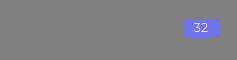

### Компонент индикатор количества новых элементов

Отображает количество новых элементов

##### Применение

```tsx
// Вариант для меню (форума)
<div style={{position: 'relative'}}>
  <CountIndicator
    count={32}
    width={39}
    height={20}
    radius={4}
    fontSize={16}
    fontWeight={400}
    top={25}
    right={25}
  />
</div>
// Вариант для аватара
<div style={{position: 'relative'}}>
  <CountIndicator
    count={32}
    width={50}
    height={50}
    radius={25}
    fontWeight={700}
    top={25}
    right={25}
    border='1px solid var(--color-primary-white)'
  />
</div>
```

##### Описание

Количество выставляется с помощью атрибута

- count

Доступны следующие css свойства:

- width
- height
- radius (соответствует border-radius)
- border (например: border='1px solid var(--color-dark-primary)')
- fontSize
- fontWeight
- top
- left
- right
- bottom

##### Представление




