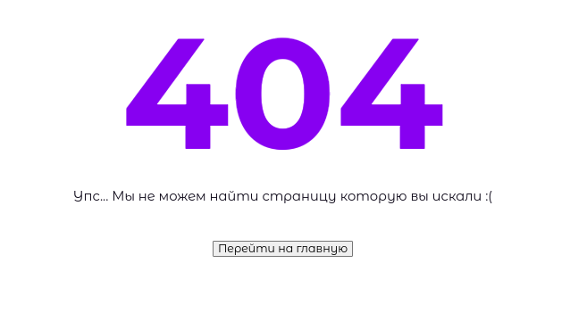

### Компонент заглушка для ошибки

##### Применение

```tsx
<ErrorStub
  title={'404'}
  subTitle={'Упс... Мы не можем найти страницу которую вы искали :('}
>
  <button>Перейти на главную</button>
</ErrorStub>
```

##### Описание

Элементы инлайновые, выравнивание происходит через

```css
 {
  text-align: center;
}
```

Кнопка передаётся как дитё.

##### Представление


